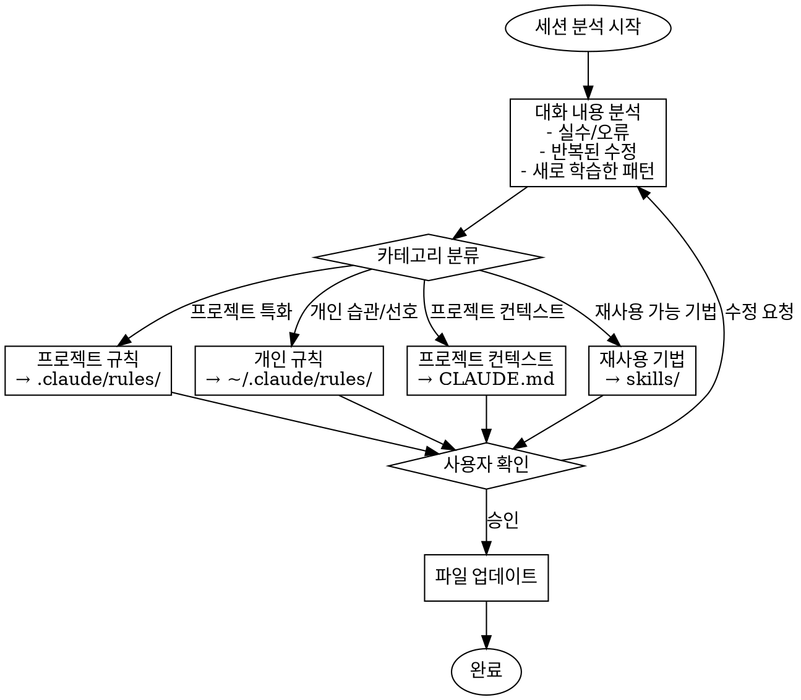

# Wrap - Session Learning Extraction

## Overview

세션을 마무리하며 발생한 실수, 학습한 패턴, 유용한 정보를 영구적으로 기록하여 다음 협업 시 동일한 실수를 방지합니다.

## When to Use

- 세션 종료 시
- 사용자가 "/wrap" 또는 "wrap" 요청 시
- 중요한 실수나 패턴을 발견했을 때
- 사용자가 "다음에 기억해줘" 류의 요청을 할 때

## Workflow



## Analysis Checklist

세션에서 다음 항목들을 찾아 분석합니다:

### 1. 실수 및 오류 패턴
- 반복적으로 수정한 코드
- 잘못된 가정으로 인한 버그
- 놓친 엣지 케이스
- 스타일/컨벤션 위반

### 2. 학습한 패턴
- 코드베이스의 새로운 패턴 발견
- 효과적이었던 접근 방식
- 도메인 특화 규칙

### 3. 사용자 선호도
- 코딩 스타일 선호
- 커뮤니케이션 스타일
- 작업 방식 선호

## Output Destinations

| 유형 | 위치 | 예시 |
|------|------|------|
| 프로젝트 규칙 | `.claude/rules/*.md` | 코드 스타일, 아키텍처 패턴 |
| 개인 규칙 | `~/.claude/rules/*.md` | 개인 선호, 습관 |
| 프로젝트 컨텍스트 | `CLAUDE.md` | 프로젝트 구조, 명령어 |
| 재사용 기법 | `~/.claude/skills/` | 범용적 기법, 패턴 |

## Rule File Format

```markdown
---
description: 이 규칙이 적용되어야 하는 상황 설명
globs:
  - "src/**/*.ts"  # 선택적: 특정 파일에만 적용
---

# 규칙 제목

## 배경
왜 이 규칙이 필요한지

## 규칙
구체적인 지침

## 예시
좋은 예 / 나쁜 예
```

## Example Output

### 프로젝트 규칙 예시 (`.claude/rules/error-messages.md`)
```markdown
---
description: 에러 메시지 작성 시 적용
globs:
  - "src/**/*.ts"
---

# 에러 메시지 규칙

## 규칙
- 에러 메시지는 항상 한국어로 작성
- 사용자 친화적인 문구 사용 ("~해요" 체)
- 기술적 세부사항은 로그에만 포함

## 예시
- ✅ "데이터를 가져오는데 실패했어요."
- ❌ "Failed to fetch data from API"
```

## Common Mistakes

| 실수 | 해결 |
|------|------|
| 너무 일반적인 규칙 | 구체적인 상황과 예시 포함 |
| 중복 규칙 생성 | 기존 규칙 먼저 확인 후 병합 |
| 프로젝트/개인 규칙 혼동 | 범용성 여부로 판단 |

## Confirmation Template

분석 완료 후 사용자에게 다음 형식으로 확인 요청:

```
## 세션 학습 내용

### 발견된 패턴/실수
1. [패턴/실수 설명]
2. ...

### 제안하는 업데이트

#### 프로젝트 규칙 (.claude/rules/)
- [ ] `rule-name.md`: [설명]

#### CLAUDE.md 업데이트
- [ ] [섹션]: [변경 내용]

#### 개인 규칙 (~/.claude/rules/)
- [ ] `rule-name.md`: [설명]

이대로 진행할까요? 수정이 필요하면 말씀해주세요.
```
